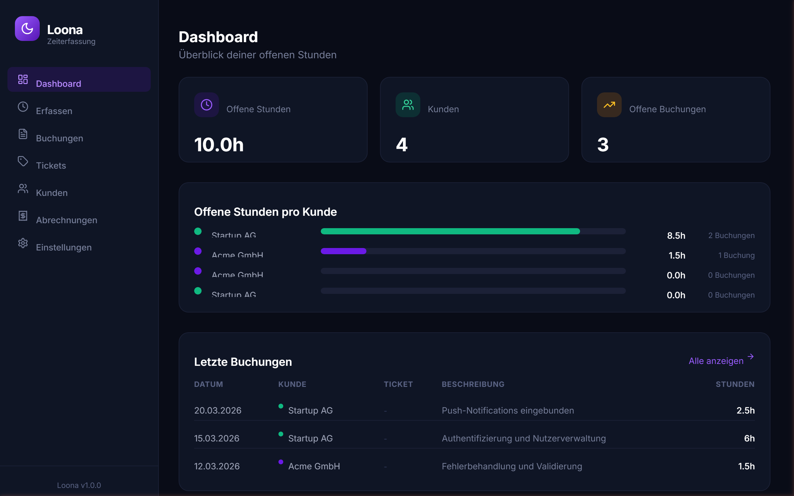
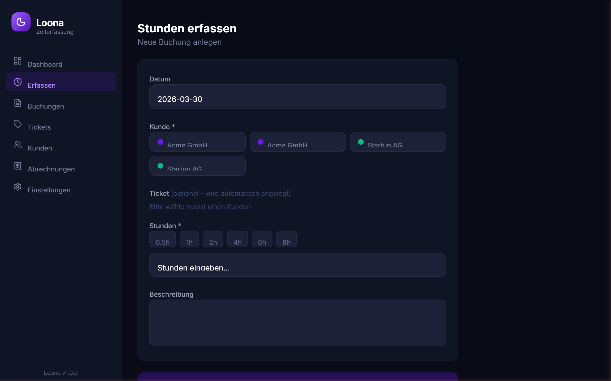
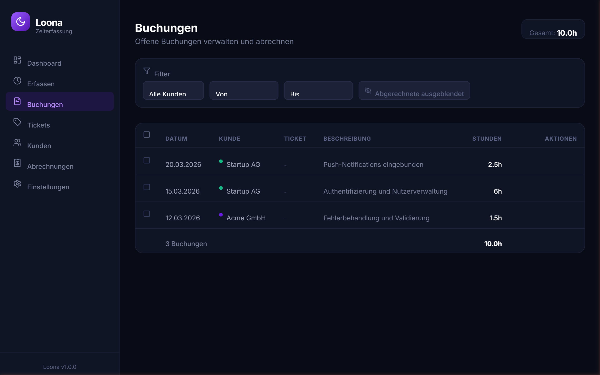
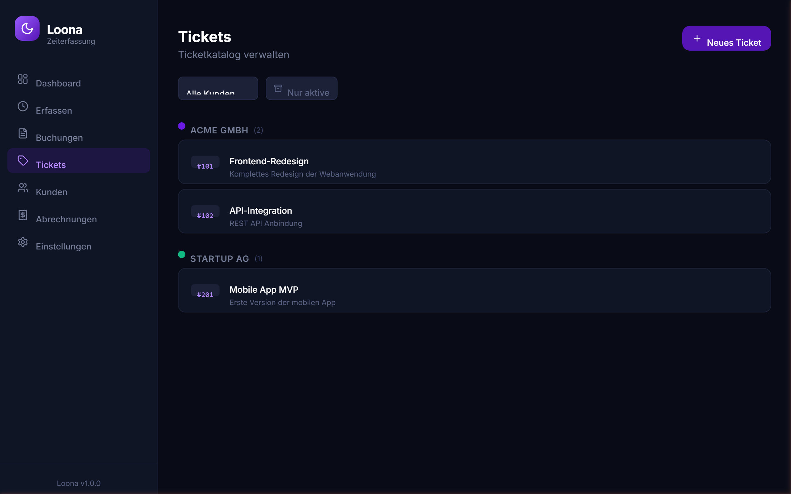
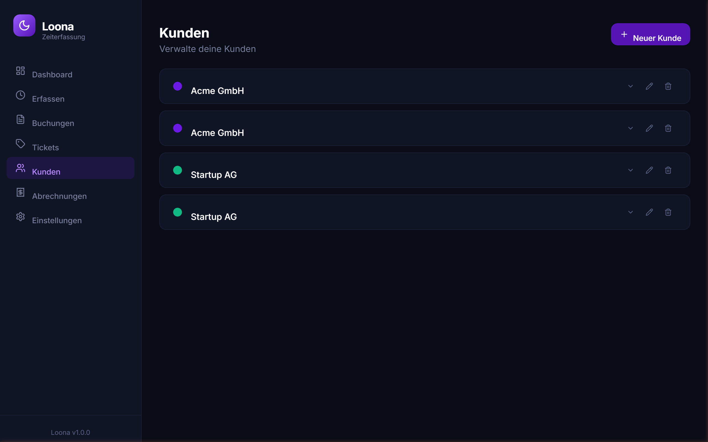
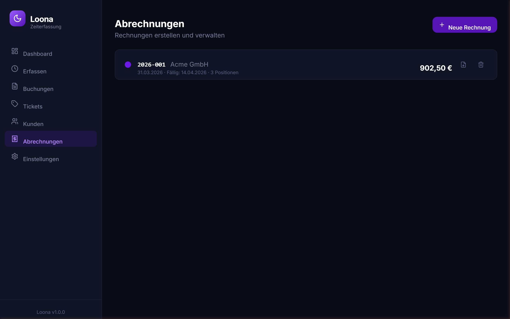
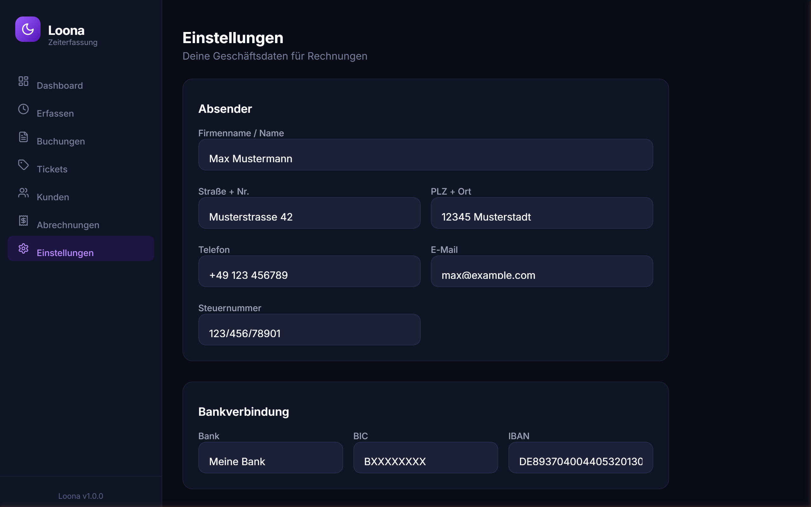

<div align="center">
  

  # Loona – Zeiterfassung

  **Einfache Zeiterfassung für Freelancer.** Stunden buchen, Kunden und Tickets verwalten, PDF-Rechnungen erstellen – als native Desktop-App für Windows, macOS und Linux.

  [](https://github.com/Mehtrick/loona-time-track/actions/workflows/ci.yml)
  [](https://github.com/Mehtrick/loona-time-track/releases)
  [](LICENSE)

</div>

---

## Features

- 📊 **Dashboard** — Live-Überblick über offene Stunden und letzte Buchungen je Kunde
- ⏱️ **Stunden erfassen** — Schnelleingabe mit One-Click-Presets (0,5h · 1h · 2h · 4h · 6h · 8h)
- 📋 **Buchungen** — Alle Einträge filtern, einsehen und abrechnen
- 🎫 **Tickets** — Arbeitsaufgaben je Kunde strukturieren und verwalten
- 👥 **Kunden** — Kunden mit Farbkennung und Rechnungsanschrift pflegen
- 🧾 **Abrechnungen** — Professionelle PDF-Rechnungen mit optionaler Obergrenze erstellen
- 🔗 **Planio-Import** — Tickets und Buchungen aus Planio/Redmine importieren
- ⚙️ **Einstellungen** — Geschäftsdaten, Bankverbindung, Stundensatz und Rechnungshinweis
- 💾 **Lokale Datenhaltung** — Alle Daten lokal als JSON-Datei, optional mit AES-256-GCM verschlüsselt, kein Cloud-Konto erforderlich
- 🔐 **Optionale Verschlüsselung** — Datenbank per Passwort schützen; Loona fragt beim Start nach dem Passwort
- 🖥️ **Plattformübergreifend** — Windows, macOS (Intel + Apple Silicon) und Linux

---

## Screenshots

| Dashboard | Stunden erfassen |
|:---------:|:----------------:|
|  |  |

| Buchungen | Tickets |
|:---------:|:-------:|
|  |  |

| Kunden | Abrechnungen |
|:------:|:------------:|
|  |  |

<div align="center">



</div>

---

## Download

Lade die aktuelle Version für dein Betriebssystem von der [Releases-Seite](https://github.com/Mehtrick/loona-time-track/releases) herunter:

| Plattform | Datei |
|-----------|-------|
| **Windows** | `Loona-Setup-X.X.X.exe` — NSIS-Installer (wählbarer Installationspfad) |
| **macOS** | `Loona-X.X.X.dmg` — Universal (Intel + Apple Silicon) |
| **Linux** | `Loona-X.X.X.AppImage` — Läuft auf allen gängigen Distributionen |

---

## Erster Start

Beim ersten Start fragt Loona, wo deine Datendatei (`loona-data.json`) gespeichert werden soll. Der Standard ist das Benutzer-Datenverzeichnis (`%APPDATA%\loona\` auf Windows). Den Pfad kannst du jederzeit über das Menü ändern:

> **Loona → Datenpfad ändern…**

Den aktuell verwendeten Pfad siehst du unter **Loona → Aktuellen Datenpfad anzeigen**.

Direkt im Anschluss bietet Loona an, die Datenbank mit einem Passwort zu schützen. Dieser Schritt kann übersprungen werden; die Verschlüsselung lässt sich jederzeit nachträglich unter **Einstellungen → Verschlüsselung** aktivieren.

Alle Daten werden ausschließlich lokal gespeichert – keine Cloud, kein Konto.

---

## Datensicherheit & Verschlüsselung

Die Verschlüsselung ist **optional** und wird vom Nutzer selbst aktiviert. Standardmäßig wird die Datendatei unverschlüsselt gespeichert.

### Verschlüsselung aktivieren

Beim ersten Start erscheint ein Einrichtungsassistent, der Verschlüsselung anbietet. Alternativ lässt sie sich jederzeit unter **Einstellungen → Verschlüsselung** ein- und ausschalten.

Einmal aktiviert, wird die Datendatei mit **AES-256-GCM** und einem per **scrypt** abgeleiteten Schlüssel verschlüsselt. Das Passwort verlässt das Gerät nie.

### Verhalten beim Start

Ist die Datenbank verschlüsselt, zeigt Loona beim Start einen **Sperrbildschirm** und lässt keine Aktionen zu, bis das korrekte Passwort eingegeben wurde.

### Passwort ändern oder Verschlüsselung entfernen

Beides ist jederzeit unter **Einstellungen → Verschlüsselung** möglich. Beim Deaktivieren wird die Datei sofort wieder im Klartext gespeichert.

### Export & Backup

Über **Einstellungen → Export** lassen sich alle Daten als unverschlüsselte JSON-Datei exportieren. So kannst du eine lesbare Sicherungskopie erstellen, unabhängig vom Verschlüsselungsstatus.

> **Wichtig:** Das Passwort kann nicht wiederhergestellt werden. Vergisst du es, sind die Daten ohne Backup nicht mehr zugänglich. Erstelle daher regelmäßig Exporte als Sicherungskopie.

---

## Entwicklung

### Voraussetzungen

- Node.js 20+
- npm 10+

### Setup

```bash
git clone https://github.com/Mehtrick/loona-time-track.git
cd loona
npm install
```

### Im Browser starten (ohne Electron)

```bash
npm run dev
# Frontend: http://localhost:5173
# Backend:  http://localhost:3001
```

### Als Electron-App starten

```bash
npm run electron:dev
```

### Tests ausführen

```bash
npm test

# Mit Coverage-Report
npm run test:coverage
```

---

## Build

### Desktop-App für die aktuelle Plattform bauen

```bash
npm run electron:build
```

Die Ausgabe landet im Ordner `release/`.

### Release veröffentlichen

Einfach ein Git-Tag erstellen und pushen — GitHub Actions übernimmt den Rest:

```bash
git tag v1.2.0
git push origin v1.2.0
```

Der Release-Workflow baut automatisch Installer für Windows, macOS und Linux und hängt sie an das GitHub Release an. Die Versionsnummer im Client wird dabei automatisch aus dem Tag übernommen.

---

## Tech Stack

| Schicht | Technologie |
|---------|-------------|
| Frontend | React 18, TypeScript, Tailwind CSS, Vite 6 |
| Backend | Express.js (eingebettet), JSON-Datei-Speicher |
| Desktop | Electron 41, electron-builder |
| PDF-Generierung | pdfkit |
| Tests | Vitest, Supertest (>97 % Coverage) |

---

## Konfiguration vor dem ersten GitHub-Upload

Passe den `build.publish`-Block in `package.json` an:

```json
"publish": {
  "provider": "github",
  "owner": "Mehtrick",
  "repo": "loona"
}
```

Ersetze auch alle Vorkommen von `Mehtrick` in dieser README durch deinen tatsächlichen GitHub-Nutzernamen.

---

## Lizenz

MIT
